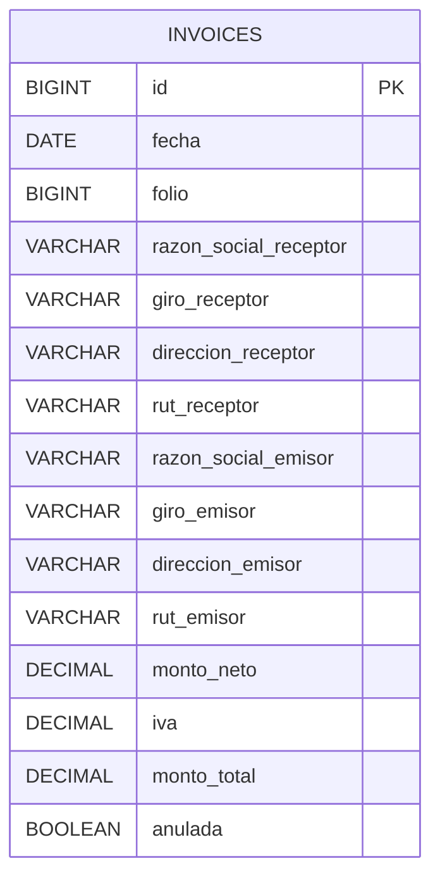

# Invoice Microservice (invoice-api v1)

## Descripción

Microservicio encargado de administrar facturas dentro del sistema.

Permite registrar facturas, consultar facturas existentes, generar folios automáticos y anular documentos.

---

## Tech Stack

* Java 25
* Spring Boot 4.0.6
* Spring Security
* JWT
* Spring Data JPA
* MySQL
* Flyway
* Docker
* Maven

---

## Funcionalidades

* Crear facturas
* Generar folio automático
* Buscar factura por folio
* Listar facturas
* Contar facturas registradas
* Anular facturas

---

## Modelo de Datos



---

## API / Endpoints

Base URL:

```txt
/api/v1/invoices
```

| Acción           | Método | Endpoint                          |
| ---------------- | ------ | --------------------------------- |
| Crear factura    | POST   | `/api/v1/invoices`                |
| Listar facturas  | GET    | `/api/v1/invoices`                |
| Buscar por folio | GET    | `/api/v1/invoices/{folio}`        |
| Contar facturas  | GET    | `/api/v1/invoices/count`          |
| Anular factura   | PUT    | `/api/v1/invoices/{folio}/anular` |

---

## Ejemplo de Request

```http
POST http://localhost:8084/api/v1/invoices
```

Body:

```json
{
  "fecha": "2026-05-31",
  "razonSocialReceptor": "Cliente Ejemplo SPA",
  "giroReceptor": "Comercio",
  "direccionReceptor": "Av. Siempre Viva 123",
  "rutReceptor": "11111111-1",
  "razonSocialEmisor": "Empresa Emisora SPA",
  "giroEmisor": "Venta de productos",
  "direccionEmisor": "Av. Principal 456",
  "rutEmisor": "22222222-2"
}
```

---

## Variables de entorno

```env
SPRING_ENV=dev
SPRING_APP_NAME=Invoice

HOST_PORT=8084

MYSQL_DATABASE=db_invoices

SPRING_JWT_SECRET=secret-key
SPRING_JWT_ISSUER=login-service
```

---

## Ejecución

```bash
docker compose up -d
mvn spring-boot:run
```

---

## Seguridad

Los endpoints protegidos utilizan JWT.

Header:

```txt
Authorization: Bearer TOKEN
```

---

## Equipo

* Eduardo Bray
* Rodrigo Callealta
* Fernando Villalobos

> DuocUC — FullStack 1 © 2026
